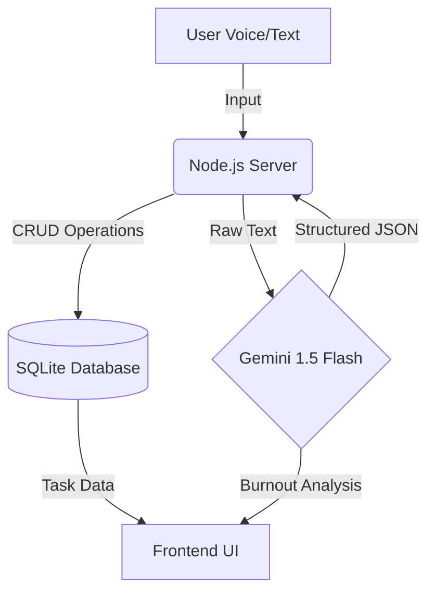

# TaskGenie 🧞‍♂️✨

> **Tagline:** A Gemini-powered Gamified Task Manager that keeps your vibe high and burnout low.


## 🚀 About The Project

**TaskGenie** isn't just another to-do list. It's an intelligent productivity companion designed to **prevent burnout** before it happens. Built for the **Gemini 3 Hackathon**, TaskGenie uses advanced AI reasoning to analyze your workload, detect stress patterns, and gamify your productivity with XP and ranks.

### Key Features
-   **🔥 Burnout Shield**: Uses **Gemini 1.5 Flash** to analyze your deadlines and task complexity, predicting burnout risks and suggesting "Vibe Restoration" breaks.
-   **🎮 Gamification Engine**: Earn XP for completing tasks. Level up from "Cadet" to "Galactic Commander".
-   **🗣️ Voice Command Protocol**: Speak naturally ("Remind me to buy coffee..."), and TaskGenie extracts the structured data instantly.

---

## 🏗️ Architecture

TaskGenie follows a modern, streamlined architecture:



1.  **Frontend**: HTML/CSS/JS (Vanilla for speed & performance).
2.  **Backend**: Node.js + Express.
3.  **AI Layer**: Google Generative AI SDK (`@google/generative-ai`).
4.  **Database**: SQLite (Local, fast, reliable).

---

## 🛠️ Setup Instructions

### Prerequisites
-   Node.js (v18+)
-   Gemini API Key

### Installation

1.  **Clone the Repo**
    ```bash
    git clone https://github.com/chsachin799/TaskGenie.git
    cd TaskGenie
    ```

2.  **Install Dependencies**
    ```bash
    npm install
    ```

3.  **Configure Environment**
    Create a `.env` file in the root directory:
    ```env
    GEMINI_API_KEY=your_api_key_here
    PORT=3000
    ```

4.  **Run the Server**
    ```bash
    npm start
    ```
    Open `http://localhost:3000` in your browser.

---

## 📜 Migration & Database Note

> **⚠️ Hackathon Note**: Files named `migrate_phase2.js`, `migrate_phase4.js`, and `migrate_gamification.js` are **incremental schema evolution scripts created specifically during this hackathon**. They represent the agile development process we followed to add new features (like Subtasks and Gamification) day-by-day. They are NOT legacy code from a previous project.

---

## 🤖 AI "Vibe" Implementation

We use **Gemini 1.5 Flash** for two distinct reasoning tasks:

1.  **Structured Data Extraction**: Converting chaos (natural language) into order (JSON objects for the database).
2.  **Strategic Reasoning (Burnout Shield)**: Analyzing the *entire* state of the user's task list to provide high-level advice, acting as a "Vibe Coach" rather than just a database interface.

```javascript
// Example of Burnout Shield Logic
const prompt = `Analyze these tasks. 
If > 3 High Priority tasks due today => Warning: High Burnout Risk.
Suggest a 15-minute break strategy.`;
```

---

## 📄 License

Distributed under the MIT License. See `LICENSE` for more information.
